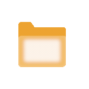

    

<h1 align="center">Hello , welcome to my corner of github.</h1>

    

  
    

<ul align="left">
  <li>
    &nbsp;&nbsp;&nbsp;<b>Digging deeper into</b> efficient fine-tuning (LoRA, QLoRA), fast inference (vLLM), and agentic systems.
  </li>
  <li>
    &nbsp;&nbsp;&nbsp;<b>Open to collaborate on</b> AI products that ship, open-source ML, and LLM/agent apps. Hard problems, clear scope, real impact.
  </li>
  <li>
    &nbsp;&nbsp;&nbsp;<b>Would love help with</b> <a href="https://t.me/DevCollab">growing a dev community on Telegram</a>. Always up for collabs and honest feedback.
  </li>
  <li>
     <b>Most of my work lives at</b> <a href="https://t.me/StellaShowcase">@StellaShowcase</a>. Side projects and experiments included.
  </li>
  <li>
     <b>Ask me about</b> Python, PyTorch, LLMs, RAG, agents, MLOps. Notebook to production, done right.
  </li>
  <li>
     <b>Reach me at</b> <a href="mailto:nextblock.dev@gmail.com">nextblock.dev@gmail.com</a> or <a href="https://t.me/StellaRay777">@StellaRay777</a>. I reply.
  </li>
  <li>
    &nbsp;&nbsp;&nbsp;<b>Fun fact:</b> Be rude to my chatbot and it starts answering like tech support from 2003.
  </li>
</ul>

<table align="center">
  <tr>
    <td align="center" width="120"> Python</td>
    <td align="center" width="120"> PyTorch</td>
    <td align="center" width="120"> TensorFlow</td>
    <td align="center" width="120"> FastAPI</td>
    <td align="center" width="120"> REST API</td>
    <td align="center" width="120"> TypeScript</td>
    <td align="center" width="120"> Node.js</td>
  </tr>
  <tr>
    <td align="center" width="120"> React</td>
    <td align="center" width="120"> Next.js</td>
    <td align="center" width="120"> PostgreSQL</td>
    <td align="center" width="120"> MongoDB</td>
    <td align="center" width="120"> Redis</td>
    <td align="center" width="120"> Docker</td>
    <td align="center" width="120"> AWS</td>
  </tr>
  <tr>
    <td align="center" width="120"> Kubernetes</td>
    <td align="center" width="120"> Linux</td>
    <td align="center" width="120"> Git</td>
    <td align="center" width="120"> GitHub</td>
    <td align="center" width="120"> Tailwind</td>
    <td align="center" width="120"> Grafana</td>
    <td align="center" width="120"> Prometheus</td>
  </tr>
</table>

    
     

 

     

